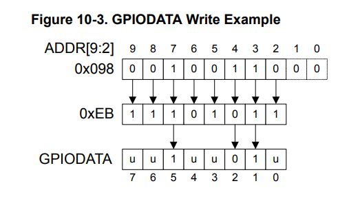
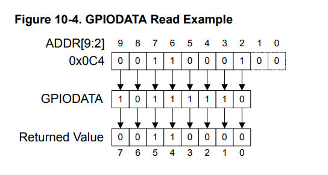

🧠 Lesson 2 — The Pitfalls of Read–Modify–Write and the Power of Atomic Access

This lesson explores a fundamental concept in embedded systems programming — the Read–Modify–Write (RMW) operation — and why it can cause race conditions in event-driven systems such as an RTOS.

💡 This post is part of my “RTOS from Scratch” learning series inspired by Miro Samek’s Modern Embedded Programming course.

⚙️ Overview

A typical GPIO operation in C may look atomic:

GPIO_PORTF_AHB_DATA_R |= LED_RED;

However, under the hood, this compiles into three separate CPU operations:

LDR R1, [R0]     ; Read  
ORR R2, R2, #2   ; Modify  
STR R2, [R0]     ; Write  

In a sequential system, this works as expected.
But in an event-driven system (where interrupts may occur anytime), this can create a race condition if an interrupt modifies the same register between the read and write steps.

💥 The Race Condition Trap

Let’s say:

The main loop turns ON the Red LED (0x02).

An ISR toggles the Blue LED (0x04).

Both start with the GPIO data register at 0x00.
If both execute an RMW sequence, the ISR’s change can be overwritten by the main loop — causing the Blue LED to stop blinking unexpectedly.

This happens because both routines operate on stale data.

✅ The Fix: Atomic Bit Access

  
  &nbsp;&nbsp;&nbsp;
  

The TM4C MCU solves this by providing bit-specific addressing for GPIO registers.
Bits [9:2] of the address bus act as a mask, allowing you to access individual bits directly — ensuring atomic writes.

For example, to set the Red LED (bit 1):

*(volatile uint32_t *)(0x40025000 + 0x200) = 0x02; // Atomic write

This operation writes only to bit 1 — no read–modify–write sequence involved.

🧠 Key Takeaways

Read–Modify–Write can lead to race conditions when interrupts are active.

Atomic bit addressing in TM4C (via [9:2] address mask) ensures bit-level safety.

Always consider hardware-supported atomic operations when writing ISRs or RTOS-critical code.
