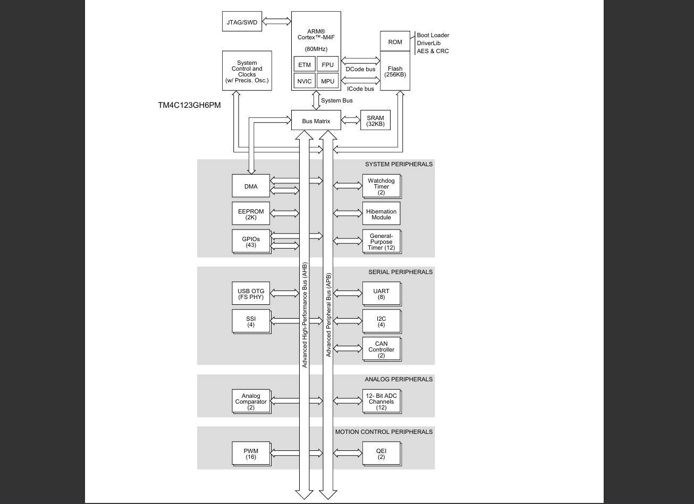
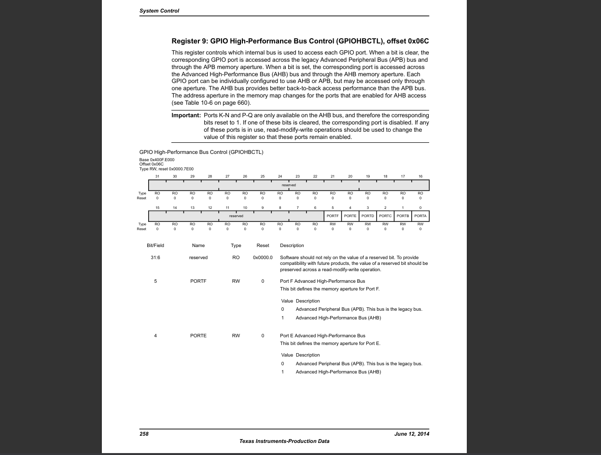

Lesson 3: APB vs AHB — Understanding Bus Architecture in TM4C123GH6PM

In the previous post, we worked with GPIO over the APB (Advanced Peripheral Bus) interface.
Now, let’s take it one step further — explore the AHB (Advanced High-Performance Bus), understand how it improves throughput, and migrate our GPIO code to use it.

🧩 Bus Overview (Pages 45–49)

<p align="center">
  
</p>

The TM4C123GH6PM MCU contains multiple internal buses connected through a Bus Matrix:

System Bus

AHB (Advanced High-Performance Bus)

APB (Advanced Peripheral Bus)

ICode/DCode Buses for instruction and data fetch (Harvard architecture)

The Bus Matrix interconnects the CPU, SRAM, Flash, DMA, and peripherals, ensuring efficient parallel transactions.

⚙️ APB — Advanced Peripheral Bus

📖 Reference: Page 48, 655 (Section 10.3)

Legacy peripheral bus, simpler design.

Lower power, sequential register access.

Used for timers, UARTs, I2C, ADC, comparators, etc.

Compatible with older ARM-based systems.

⚡ AHB — Advanced High-Performance Bus

📖 Reference: Page 48, 655 (Section 10.3)

32-bit pipelined system bus.

Used for high-speed peripherals like GPIO, USB, and DMA.

Provides faster back-to-back access performance.

Same register map as APB — so code migration is seamless.

🔧 Switching from APB → AHB

<p align="center">
  
</p>

Each GPIO port can be configured to use either APB or AHB.
The control register GPIOHBCTL (Page 258) determines which bus interface is active for each port.

1️⃣	Enable AHB for the desired port	SYSCTL_GPIOHBCTL_R
2️⃣	Enable GPIO clock	SYSCTL_RCGCGPIO_R
3️⃣	Use AHB register map	GPIO_PORTx_AHB_*

💻 Example Code

```
#include "tm4c.h"

#define LED_RED   (1U << 1)
#define LED_BLUE  (1U << 2)
#define LED_GREEN (1U << 3)

void delay(int time){
    int volatile counter = 0;
    while (counter < time) ++counter;
}

int main(void) {
    SYSCTL_GPIOHBCTL_R |= (1U << 5); /* Enable AHB for GPIOF */
    SYSCTL_RCGCGPIO_R  |= (1U << 5); /* Enable clock for GPIOF */

    GPIO_PORTF_AHB_DIR_R |= (LED_RED | LED_BLUE | LED_GREEN);
    GPIO_PORTF_AHB_DEN_R |= (LED_RED | LED_BLUE | LED_GREEN);

    while (1) {
        GPIO_PORTF_AHB_DATA_BITS_R[LED_RED] = LED_RED;
        delay(1000000);
        GPIO_PORTF_AHB_DATA_BITS_R[LED_RED] = 0;
        delay(1000000);
    }
}

```

🧠 Key Takeaways

APB: Legacy, sequential, low-power bus.

AHB: High-speed, pipelined, parallel access bus.

Simple migration — just switch GPIOHBCTL and use AHB register macros.

AHB gives faster response for frequent GPIO toggling and ISR-driven events.
