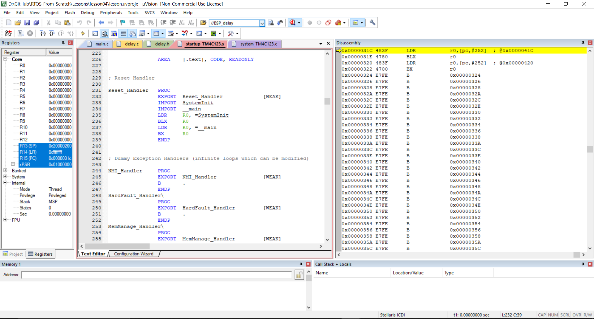
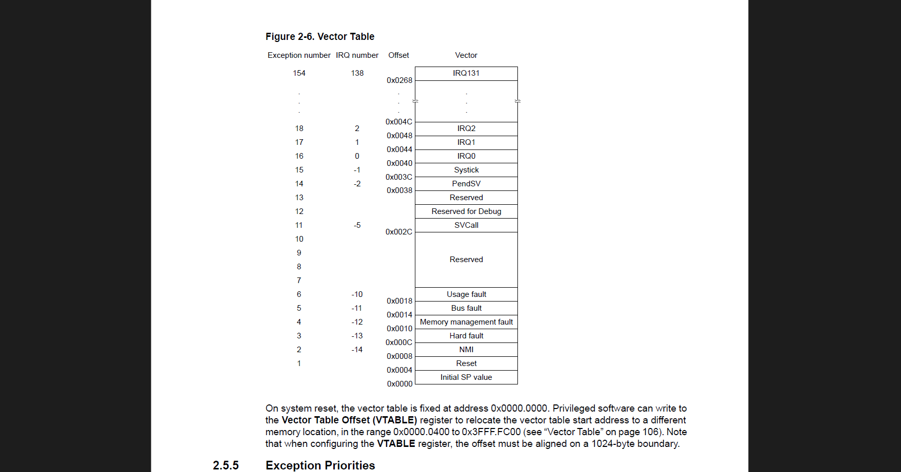
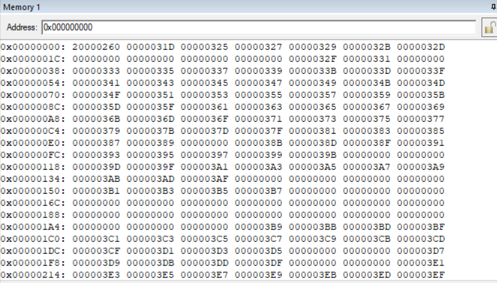

Lesson 4: A World Before main() — Understanding the Startup Code in TM4C123GH6PM

Before our main() function executes, the system performs a series of low-level hardware and memory initialization steps. In this lesson, we’ll explore what happens during the startup sequence — from reset to main() — and understand how the stack pointer (SP) and program counter (PC) obtain their initial values.

🔍 Debugging Before main()

  

If we disable the “Run to main()” option in the debugger and start execution, we land in the world before main.

When observing the register view, we can see:
👉 Registers R0–R12 are initialized to 0
👉 SP and PC already hold valid values

These are set up by the startup code even before the C runtime environment begins.

⚙️ Startup Flow — What Happens Before main()

Stepping through the startup process reveals two main phases:

1️⃣ Low-Level Hardware Initialization

👉 Configures system clock and oscillators
👉 Sets up the Floating Point Unit (FPU)
👉 Prepares chip-specific peripherals for runtime

2️⃣ C Runtime Initialization

👉 Copies initialized global/static data from ROM → RAM (.data section)
👉 Zero-initializes .bss memory section for uninitialized variables

Once these steps complete, control is passed to the main() function.

📘 Vector Table and the Reset Sequence

  
  

After reset, the MCU begins execution at address 0x00000000, which holds the vector table.
This table provides the initial values for SP and PC, as well as pointers to interrupt handlers.

0x00000000	Initial Stack Pointer (SP)	0x20000260	Loaded into SP register
0x00000004	Reset Handler (PC)	0x0000031C	Loaded into PC register
0x00000008+	Exception / ISR vectors	-	Addresses of handlers

The Vector Table Offset Register (VTOR) can be used to relocate this table to a different memory region if required.

🧩 Default Startup Handlers

In the default startup file provided with most toolchains, all interrupt handlers are implemented as infinite while loops — acting as placeholders until the user defines them.

We’ll soon replace these with custom handlers as we build our own startup code.

🧠 Key Takeaways

👉 Before main(), the MCU executes initialization routines for hardware and memory.
👉 SP and PC are loaded from the vector table during the reset sequence.
👉 The startup code sets up a valid runtime environment before handing control to main().
👉 Custom startup code allows fine-grained control over memory and boot sequence.

Up Next: We’ll implement our custom startup code — defining our own vector table, reset handler, and initialization sequence from scratch.