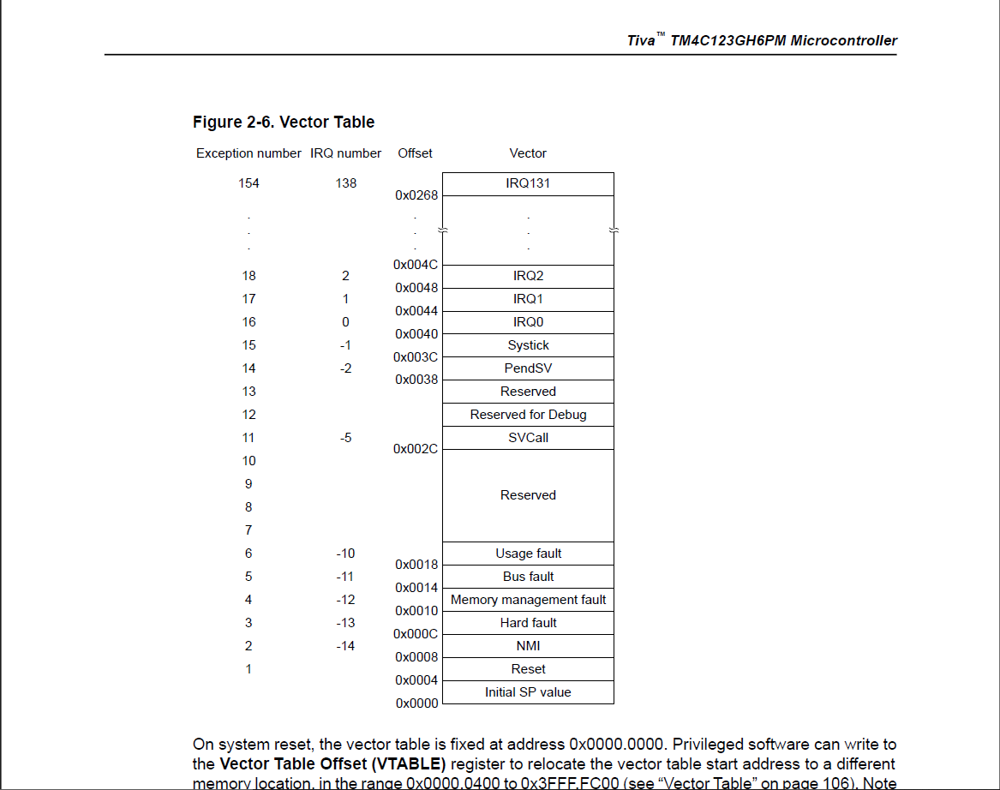
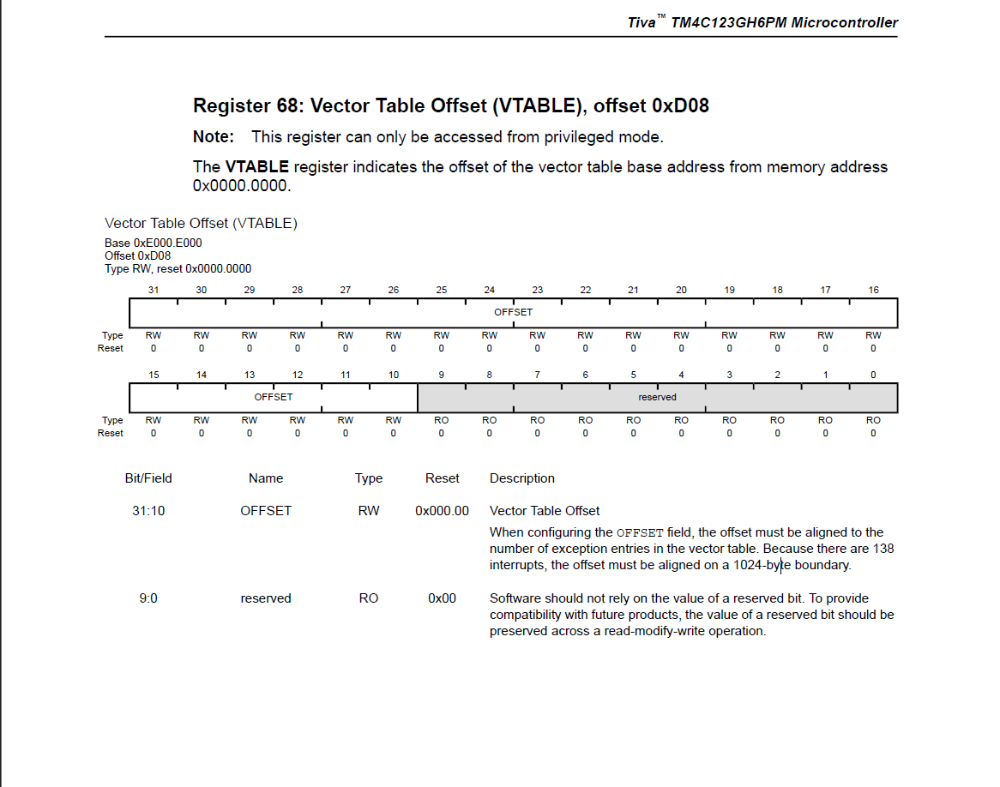

🧠 Lesson 5 — The Startup Code Deep Dive

  
  

In this lesson, we explore one of the most crucial yet often overlooked parts of embedded systems — the startup code.
This is where everything begins, even before main() is called.

🔍 What’s inside the Startup Code?

At its core, the startup code defines:

The stack boundaries (through linker symbols __stack_start__ and __stack_end__).

Default exception and interrupt handlers — all weakly aliased to a single Default_Handler.

The Vector Table, mapping each interrupt and exception to its handler.

The Reset Handler, which acts as the true entry point for our system.

⚙️ The Reset Handler — Where It All Starts

Reset_Handler is executed immediately after a reset event (power-on, watchdog, or software reset).
Its responsibilities include:

Relocating the Vector Table to a protected memory region.

Initializing .data and .bss sections.

Calling SystemInit() for CMSIS-level setup.

Optionally invoking software_init_hook() — to hand over control to the RTOS.

Finally, calling main() — the beginning of user application code.

🚨 Fault Handlers

Each fault — NMI, HardFault, MemManage, BusFault, UsageFault — is given its own handler, all of which:

Disable interrupts,

Reset the stack pointer,

Invoke assert_failed() to handle errors gracefully.

🧩 Vector Table Layout

The vector table is placed in a special section .isr_vector and begins with:

The initial stack pointer value.

The address of the Reset_Handler.

The rest of the exception and IRQ handlers.

This forms the foundation that the Cortex-M CPU reads during reset to know where to begin execution and how to handle interrupts.

🧰 Why This Matters

Before our RTOS ever boots, this code ensures:

The system memory is initialized correctly.

Faults are handled predictably.

Interrupts are safely routed.

The CPU environment is ready for multitasking.

This file effectively bridges hardware reset and the RTOS kernel startup.
