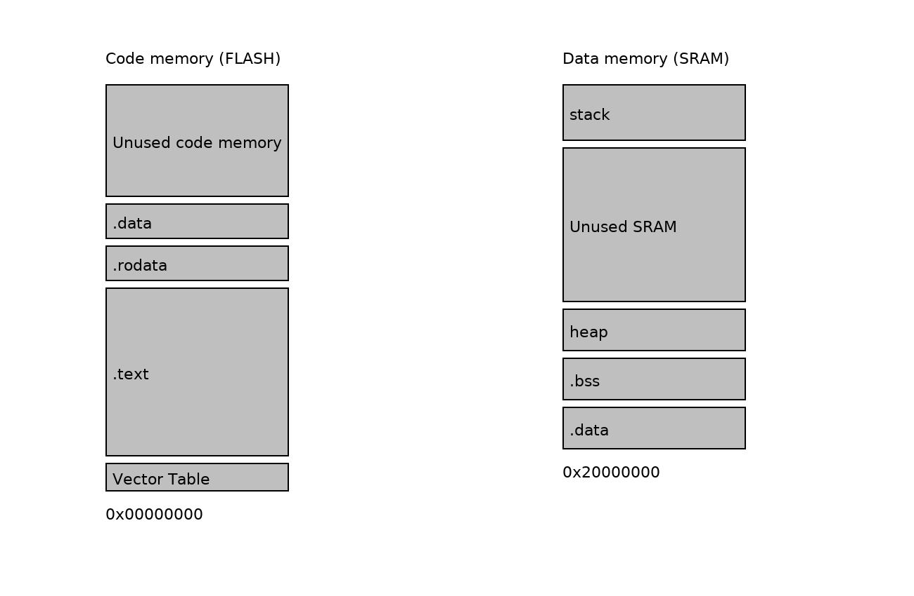

🧠 Lesson 6 — Understanding the Linker Script & Map File

<p align="center">  </p>


In this lesson, we explore how the linker script shapes our firmware's memory layout and how the map file helps us verify and debug that layout.
This is where our code, constants, globals, stack, and heap are placed into Flash and SRAM, exactly where the hardware expects them.

🔍 What Does the Linker Script Do?

The linker script defines where every piece of your program lives in memory:

Region	Stored In	Typical Contents
.text	Flash (ROM)	Code + Read-only constants
.data	RAM (copied at startup)	Global variables with initial values
.bss	RAM (zero-initialized)	Global variables without initial values
.stack	RAM	Runtime stack frames
.heap	RAM	Dynamic memory (malloc)

Your script defines two memory regions:

MEMORY {
    ROM (rx)  : ORIGIN = 0x00000000, LENGTH = 256K
    RAM (xrw) : ORIGIN = 0x20000000, LENGTH = 32K
}

This tells the linker:

Code and constants must go into Flash (ROM).

Variables and runtime data must go into SRAM (RAM).

🧩 Section Breakdown (Line-by-Line Overview)

1) Vector Table (.isr_vector) — Must be First in Flash

```
.isr_vector : {
    KEEP(*(.isr_vector))
    . = ALIGN(4);
} >ROM
```

This ensures the CPU sees:

Initial Stack Pointer

Reset_Handler

Exception & IRQ handlers

right at address 0x00000000 after reset.

2) Code & Constants (.text & .rodata) — Stored in Flash

```
.text : {
    *(.text*)
    *(.rodata*)
} >ROM
_etext = .;
```

Program instructions (.text) and constant data (.rodata) are executed directly from Flash.

_etext marks the boundary where initialized data begins in Flash.

3) Initialized Variables (.data) — Copied from Flash → RAM

```
.data : AT(_etext) {
    __data_start = .;
    *(.data*)
    __data_end__ = .;
} >RAM
```

During startup, the Reset_Handler copies .data values from Flash to RAM.

Example from main.c:

```
uint8_t x = 'A';  // Stored in .data (ROM → copied to RAM)
uint32_t y = 1;   // Same here
```

4) Uninitialized Variables (.bss) — Zeroed in RAM

```
.bss : {
    __bss_start__ = .;
    *(.bss*)
    *(COMMON)
    __bss_end__ = .;
} >RAM
```

Startup code clears this region to zero.

From main.c:

```
uint8_t c;   // Goes to .bss (zeroed)
uint16_t d;  // Same here
```

5) Stack & Heap Allocation

```
.stack : {
    __stack_start__ = .;
    . = . + STACK_SIZE;
    __stack_end__ = .;
} >RAM
```

Defines stack size and exact boundaries — critical for call depth & interrupt safety.

📄 The Map File — Your Memory Validation Tool

Once compiled, the map file shows exactly where everything ended up.

You can read it to confirm:

Functions fit in Flash

Variables are placed correctly in RAM

Stack/heap do not overflow available space

Example Map Insights

Section	Address	Meaning
```
.text	0x00000000 → 0x00004xxx	Your firmware code in Flash
.data	0x20000000 → 0x200000xx	Initialized globals in RAM
.bss	Ends near .data	Zero-initialized globals
__stack_start__	Near top of RAM	Stack growing downward
__heap_start__	After .bss	Dynamic memory region
```

Using the map:

Check whether .data + .bss is too large.

Ensure stack has safe headroom.

Validate no overlap occurs between heap and stack.

This becomes especially critical once RTOS tasks enter the picture.

✅ Key 

Linker Script	Defines where every byte of code & data lives
.text, .data, .bss	Each has a specific memory placement and initialization rule
Reset_Handler	Copies .data, zeros .bss, prepares runtime environment
Map File	Used to verify memory layout & catch overflow issues early
Stack & Heap	Must be carefully sized to avoid hard faults and corruption

🧩 This Lesson Bridges Software and Hardware

Before an RTOS scheduler runs…
Before main() starts blinking LEDs…
Before interrupts fire…

The linker script + map file define the foundation that makes the system stable.